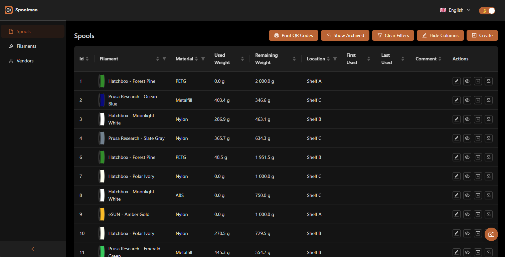

<picture>
  <source media="(prefers-color-scheme: dark)" srcset="assets/spoolman-logo-dark.svg">
  <source media="(prefers-color-scheme: light)" srcset="assets/spoolman-logo-light.svg">
  
</picture>

<br/>

_Keep track of your inventory of 3D-printer filament spools._

> ### 🚀 Spoolman NG
> **Spoolman NG** is a community-maintained continuation of the original [Spoolman](https://github.com/Donkie/Spoolman) by Donkie. It stays drop-in compatible while adding new features (NFC spool identification, QR-code label printing, a redesigned dashboard, and merged community PRs) and ships under its own Docker images and releases:
>
> | | |
> |---|---|
> | **GHCR** | `ghcr.io/sherrmann/spoolman-ng` |
> | **Docker Hub** | `cookiemonster95/spoolman-ng` |

Spoolman NG is a self-hosted web service designed to help you efficiently manage your 3D printer filament spools and monitor their usage. It acts as a centralized database that seamlessly integrates with popular 3D printing software like [OctoPrint](https://octoprint.org/) and [Klipper](https://www.klipper3d.org/)/[Moonraker](https://moonraker.readthedocs.io/en/latest/). When connected, it automatically updates spool weights as printing progresses, giving you real-time insights into filament usage.

[](https://github.com/sherrmann/Spoolman-NG/releases)
[](https://sherrmann.github.io/Spoolman-NG/)
[](https://github.com/Donkie/Spoolman)
[](docs/installation.md)

### Features
* **Filament Management**: Keep comprehensive records of filament types, manufacturers, and individual spools.
* **API Integration**: The [REST API](https://sherrmann.github.io/Spoolman-NG/) allows easy integration with other software, facilitating automated workflows and data exchange.
* **Real-Time Updates**: Stay informed with live spool updates through Websockets, providing immediate feedback during printing operations.
* **Central Filament Database**: A community-supported database of manufacturers and filaments simplify adding new spools to your inventory. Spoolman NG syncs from its own [SpoolmanDB](https://github.com/sherrmann/SpoolmanDB) (continuing the original database) — contribute filaments there, or point `EXTERNAL_DB_URL` at another instance.
* **Web-Based Client**: Spoolman includes a built-in web client that lets you manage data effortlessly:
  * View, create, edit, and delete filament data.
  * Add custom fields to tailor information to your specific needs.
  * Print labels with QR codes for easy spool identification and tracking.
  * Available in 30 languages (UK English is the default; US English and 28 others selectable). The upstream [Weblate project](https://hosted.weblate.org/projects/spoolman/) feeds the original repository, not this fork — contribute translations by editing `client/public/locales/<lang>/common.json` in a pull request; CI validates that every translation keeps its placeholders.
* **NFC Spool Identification**: Scan NFC tags to instantly identify and select spools. Supports three tag standards:
  * [TigerTag](https://tigertag.io/) (ISO 14443A / NTAG213) — binary format with external product database lookup.
  * [OpenPrintTag](https://openprinttag.org/) (ISO 15693 / NFC-V) — Prusa's NDEF/CBOR standard with per-spool UUIDs.
  * [Qidi](https://wiki.qidi3d.com/en/QIDIBOX/RFID) (ISO 14443A / MIFARE Classic 1K) — Qidi filament tags with material and color identification.
  * Two read paths: an **in-browser scanner** (Web NFC — Chrome on Android over **HTTPS** only) and an optional **server-side USB reader**. They don't cover the same tags: the USB reader reads TigerTag (NTAG213) and Qidi (MIFARE Classic) only, while **OpenPrintTag (ISO 15693 / NFC-V) is browser-only** — there is no USB path for it. See [docs/nfc.md](docs/nfc.md) for the full matrix, hardware, and setup.
  * Automatic spool creation from tag data when scanning unrecognized tags.
  * External integration endpoint (`POST /api/v1/nfc/lookup`) for Klipper NFC daemons and other clients.
* **Mobile Companion App** (proof of concept): a thin Android/iOS shell around the web UI in [`mobile/`](mobile/README.md) that adds **native camera scanning and native NFC** — no HTTPS setup needed, works against plain-HTTP LAN servers, and brings NFC to iPhones (which have no Web NFC). Design and roadmap in [docs/mobile-companion-app.md](docs/mobile-companion-app.md).
* **Database Support**: SQLite, PostgreSQL, MySQL, and CockroachDB.
* **Multi-Printer Management**: Handles spool updates from several printers simultaneously.
* **Advanced Monitoring**: Integrate with [Prometheus](https://prometheus.io/) for detailed historical analysis of filament usage, helping you track and optimize your printing processes. See [docs/monitoring.md](docs/monitoring.md) for setup and example queries.

### Integrations

**Spoolman integrates with:**
  * [Moonraker](https://moonraker.readthedocs.io/en/latest/configuration/#spoolman) and most front-ends (Fluidd, KlipperScreen, Mainsail, ...)
  * [OctoPrint](https://github.com/mdziekon/octoprint-spoolman)
  * [OctoEverywhere](https://octoeverywhere.com/spoolman?source=github_spoolman)
  * [Home Assistant](https://github.com/Disane87/spoolman-homeassistant)
  * [MCP Server](https://github.com/Disane87/spoolman-mcp) - Manage your filament inventory through AI assistants like Claude using the Model Context Protocol

#### Raspberry Pi Imager 3D-printing appliances

Flashing an OS from the Raspberry Pi Imager **3D printing** menu? Here is how each appliance in that catalog works with Spoolman:

| Appliance (RPi Imager) | Stack | Spoolman support | How |
|---|---|---|---|
| OctoPi | OctoPrint | ✅ | [OctoPrint-Spoolman plugin](https://github.com/mdziekon/octoprint-spoolman) |
| OctoKlipperPi | OctoPrint → Klipper | ✅ | [OctoPrint-Spoolman plugin](https://github.com/mdziekon/octoprint-spoolman) |
| Mainsail OS | Klipper/Moonraker | ✅ first-class | Moonraker [`[spoolman]`](https://moonraker.readthedocs.io/en/latest/configuration/#spoolman) + Mainsail/Fluidd/KlipperScreen panels |
| PrintWatch OS | OctoPrint | ✅ | [OctoPrint-Spoolman plugin](https://github.com/mdziekon/octoprint-spoolman) (PrintWatch adds failure detection only) |
| SimplyPrint | Cloud (OctoPrint/Bambu) | ⚠️ one-way import | Export → SimplyPrint Filament Manager (see #312) |
| DuetPi | RepRapFirmware/DWC | ❌ none | Proposed DWC plugin (see #313) |
| Repetier-Server | Repetier | ❌ none | Has its own filament manager (see #314) |
| 3DPrinterOS | Cloud (commercial) | ❌ out of scope | Closed ecosystem |

**Adjacent tools** that work with Spoolman but aren't Imager images: [Fluidd](https://docs.fluidd.xyz/), [KlipperScreen](https://klipperscreen.readthedocs.io/), [Home Assistant](https://github.com/Disane87/spoolman-homeassistant), and [OctoEverywhere](https://octoeverywhere.com/spoolman?source=github_spoolman).

**Web client preview:**


## Installation

Spoolman NG ships Docker images for `amd64`, `arm64`, and `armv7`. `amd64` and
`arm64` are the recommended targets for new installs; `armv7` (32-bit ARM) is
best-effort — see [Deployment & Hardware](#deployment--hardware) for the honest
support policy before choosing it.

### Docker (recommended — and the only supported option on Windows/macOS)

A minimal `docker-compose.yml`:

```yaml
services:
  spoolman:
    image: ghcr.io/sherrmann/spoolman-ng:latest # or cookiemonster95/spoolman-ng:latest on Docker Hub
    restart: unless-stopped
    volumes:
      - ./data:/home/app/.local/share/spoolman
    ports:
      - "7912:8000"
    environment:
      - TZ=Europe/Stockholm
```

Then open `http://localhost:7912`. Image tags:

* `:latest` — the newest release
* `:YYYY.M.PATCH` — a pinned release (e.g. `:2026.6.0`)
* `:edge` — the latest `master` build
* `:sha-<commit>` — a specific commit

> **Following an upstream Spoolman guide?** (PiMyLifeUp, OctoEverywhere, printys, …) Wherever it says `ghcr.io/donkie/spoolman` (or `donkieyo/spoolman` on Docker Hub), use `ghcr.io/sherrmann/spoolman-ng` (or `cookiemonster95/spoolman-ng`) instead — everything else in those guides (ports, volume path, environment variables) works unchanged.

> **Coming from `ghcr.io/sherrmann/spoolman`?** The images moved with the repository rename to `Spoolman-NG`: the old `ghcr.io/sherrmann/spoolman` / `cookiemonster95/spoolman` names stay pullable but are frozen at the last tag published before the rename. Point your compose file at `ghcr.io/sherrmann/spoolman-ng` (or `cookiemonster95/spoolman-ng`) — your data volume and settings carry over unchanged.

> **Windows & macOS:** use Docker. The native install below is Linux-only (it relies on `bash` + `systemd`).

### Home Assistant add-on (experimental)

Home Assistant OS / Supervisor users can run the server as an add-on — no separate Docker host
needed. Add the dedicated add-on repository
[`sherrmann/spoolman-ng-addons`](https://github.com/sherrmann/spoolman-ng-addons) under
**Settings → Add-ons → Add-on Store → ⋮ → Repositories**, install **Spoolman NG**, and open port
`8000`. The add-on tracks releases automatically — updates appear in the HA UI like any other
add-on.

### Native install (Linux, no Docker)

Best for running Spoolman directly on a host — e.g. on a Raspberry Pi next to Klipper/Moonraker. One line fetches the latest release and runs the installer (it sets up `uv`, the Python dependencies, and an optional `systemd` service):

```bash
curl -fsSL https://github.com/sherrmann/Spoolman-NG/releases/latest/download/spoolman.zip -o spoolman.zip \
  && unzip spoolman.zip -d ~/Spoolman && cd ~/Spoolman && bash ./scripts/install.sh
```

The UI then runs on `http://<host>:7912` (configurable via `.env`). Your database lives in a separate data directory, so updates never touch it. Update later with `bash scripts/update.sh` (or one-click from Moonraker, below).

> The native install omits the optional **NFC** feature by default; add it on any platform with `uv sync --extra nfc`.

**Using [KIAUH](https://github.com/dw-0/kiauh)?** A [community extension](integrations/kiauh/README.md) for KIAUH v6 performs this install (plus all the Moonraker wiring below) from KIAUH's Extensions menu — install, update, and remove without touching a config file.

### One-click updates from Moonraker (Klipper users)

If you run Klipper, you can update Spoolman NG straight from Mainsail/Fluidd. Add this to your `moonraker.conf` (adjust `path` to your install directory) and add `Spoolman` on its own line to `~/printer_data/moonraker.asvc` so Moonraker may restart the service:

```ini
[update_manager Spoolman]
type: zip
channel: stable
repo: sherrmann/Spoolman-NG
path: ~/Spoolman
virtualenv: .venv
requirements: requirements.txt
persistent_files:
  .env
  uv
managed_services: Spoolman
```

Spoolman NG then shows up in your printer UI's update list, tracks new releases automatically, reinstalls changed Python dependencies, and restarts the service after each update. Do **not** use `type: web` — Moonraker's web updater is for static front-ends and deletes the virtualenv on update. See the [Moonraker update notes](docs/installation.md#one-click-updates-from-moonraker-klipper-users) for details and for migrating an install set up before this recipe existed.

For all configuration options (databases, backups, base path, every environment variable), see the [Installation & Configuration guide](docs/installation.md).

## Deployment & Hardware

Spoolman NG is light — it happily runs next to Klipper/Moonraker on a
Raspberry Pi 3/4-class SBC. Dashboard analytics stay snappy even at 10k spools
(~43 ms aggregation), so the CPU is not a scaling concern; storage is whatever
your database needs (the default SQLite file is tiny).

**Architectures & support policy.** Images are built and published for all three
arches to both [`ghcr.io/sherrmann/spoolman-ng`](https://github.com/sherrmann/Spoolman-NG/pkgs/container/spoolman-ng)
and Docker Hub `cookiemonster95/spoolman-ng`:

| Arch | CI coverage | Notes |
|---|---|---|
| `amd64` | Full 4-database integration matrix (SQLite/Postgres/MySQL/CockroachDB) | Recommended. |
| `arm64` | QEMU boot + `/api/v1/health` smoke only | Recommended for SBCs (Pi 3/4/5 64-bit OS). |
| `armv7` | QEMU boot + `/api/v1/health` smoke only | **Best-effort.** 32-bit ARM compiles `psycopg2`/`greenlet`/`cbor2` from source (via an `LD_PRELOAD` workaround) and uses pure-Python `cbor2` 5.x. It is supported for the foreseeable future, but 32-bit ARM is a shrinking platform — **prefer arm64 for new installs** where your hardware allows a 64-bit OS. |

The ARM images get only a boot + health-check smoke test in CI (not the full
integration matrix), so treat arm64/armv7 as verified-to-start rather than
matrix-tested.

**Ways to run.** All three are covered under [Installation](#installation) above:

- **Docker / Compose** — recommended, and the only supported option on Windows/macOS.
- **Native install** (Linux) — the one-line [`scripts/install.sh`](scripts/install.sh)
  (Debian/Arch/Fedora detection; not exercised in CI) sets up `uv`, dependencies,
  and an optional `systemd` service.
- **Moonraker one-click updates** for Klipper users.

Databases: SQLite (default, zero-config), PostgreSQL, MySQL/MariaDB, and CockroachDB.

**NFC hardware.** Full guide in **[docs/nfc.md](docs/nfc.md)**. In short:

- Two read paths: an **in-browser scanner** (Web NFC) and an optional
  **server-side USB reader** (nfcpy).
- **Browser scanning needs Chrome on Android over HTTPS** — it will not work on a
  plain-HTTP LAN address like `http://pi:7912`; put Spoolman behind a TLS reverse
  proxy (Caddy/nginx recipe in the guide).
- The **USB reader reads TigerTag (NTAG213) and Qidi (MIFARE Classic 1K) only**;
  **OpenPrintTag (NFC-V) is browser-only** (no USB path).
- Reader families targeted in code — **PN532, RC522, ACR122U-class** — are
  *expected to work* via nfcpy but are **not hardware-verified**; reports welcome.
- Docker needs the reader passed through (`devices: - /dev/bus/usb:/dev/bus/usb`);
  native installs typically need a udev rule for non-root access. Enable with
  `SPOOLMAN_NFC_ENABLED=TRUE`.

**Label printing, QR codes & swatches.** Rendered entirely **client-side in the
browser** — no special hardware. Labels print to any printer your OS can reach;
QR codes are sized to be scannable at your nozzle width; and color swatches
download as 3MF files you print on your own machine.

## Security & exposure

By default Spoolman has **no authentication** — it targets trusted home/LAN networks alongside Klipper, Moonraker, and OctoPrint. Anyone who can reach the port can read and modify your inventory, including endpoints that create spools automatically from scanned tags (`POST /api/v1/nfc/lookup`) and write physical NFC tags through a connected reader (`POST /api/v1/nfc/write`).

Authentication is **opt-in** (choose either or both):

* **Set `SPOOLMAN_API_TOKEN`** to require a shared bearer token. When set, every `/api/v1` request must send `Authorization: Bearer <token>` (websockets pass it as a `?token=` query parameter), except `GET /api/v1/health` and the OpenAPI docs. The web UI prompts for the token and stores it in the browser. Integration support differs: the **OctoPrint plugin can send the token** (set its API-key header to `Authorization` with value `Bearer <token>` — covered by our e2e tests), but **Moonraker cannot** — its `[spoolman]` component has no auth option, so setting a token breaks Klipper filament tracking. Do not set `SPOOLMAN_API_TOKEN` on an instance that Klipper printers report to; keep it token-free inside the trusted LAN and gate external access at a reverse proxy or VPN instead. `/metrics` and the static web assets are not behind this token. This is a single shared machine secret; the token keeps working as a never-expiring key even alongside accounts.
* **Create user accounts** under **Settings → Users** for per-user password login with **administrator** and **read-only** roles. Once any account exists, the web UI requires login; passwords are stored only as salted `scrypt` hashes. See [Authentication & user accounts](docs/installation.md#authentication--user-accounts).
* For federated auth (SSO/OIDC) or another layer, put it behind an authenticating reverse proxy (e.g. [Authelia](https://www.authelia.com/), [OAuth2 Proxy](https://oauth2-proxy.github.io/oauth2-proxy/), Caddy/nginx basic auth) or access it over a VPN such as WireGuard or Tailscale.
* Don't run with `SPOOLMAN_DEBUG_MODE=TRUE` in production — it relaxes CORS to allow all origins.

To report a security vulnerability, see [SECURITY.md](SECURITY.md).
